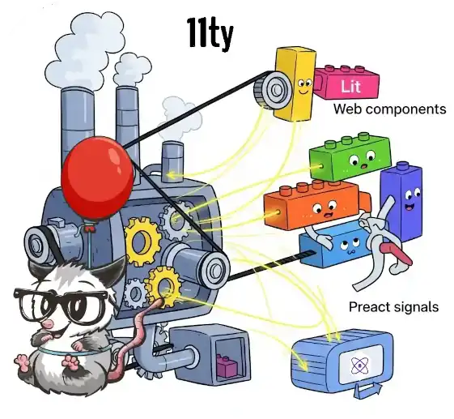

# Eleventy+Lit build boilerplate



This project serves as a foundational boilerplate for architecting static websites utilizing the [Eleventy](https://www.11ty.dev/) static site generator (SSG). It incorporates [Lit](https://lit.dev/) web components with server-side rendering (SSR) capabilities and integrates [Preact](https://preactjs.com/) signals for reactive state management following the style of some Google products.  
It provides the essential toolkit for developing sites by using the full power of browser technologies and progressively enhancing them with Vanilla JavaScript.

**Install**

1. [Install Node.js.](http://nodejs.org/)
2. [Clone the repository or download the Eleventy+Lit Boilerplate source.](url)
3. Start creating your site in `site` and `src` directories.

**Quick Start**

Tasks are managed with [wireit](https://github.com/google/wireit).  
Environments are demarcated by task suffixes. Default environments are `dev` and `prod`.

> **Note:** Due to reliance on POSIX-specific environment variable handling within scripts, this project's execution is limited to *POSIX-compliant console environments*.

To launch the dev environment:
1. In bash/terminal/command line, `cd` into your project directory.
2. Run `npm install`.
3. Run `npm run dev`.

This will spin up a dev server in the background and your default browser will auto-launch pointing to your Eleventy site.

## Documentation

This is a boilerplate that you can use as a starting point for your projects.

[Running Tasks](#running-tasks) · [Eleventy](#eleventy) · [Server](#server) · [TypeScript](#typescript) · [SSR](#ssr) · [Inline scripts](#inline-scripts) · [Signals](#signals) · [Fonts](#fonts) · [Images](#images) · [commitlint](#commitlint)


### Running Tasks

The boilerplate uses the `npm run` command to run tasks.

```bash
# Main Tasks
npm run dev         # alias of serve:dev --watch (watches for changes)
npm start           # alias of serve
npm run serve:dev   # prepares dev environment and starts Web Dev Server
npm run serve       # prepares prod environment and starts Web Dev Server
npm run build:dev   # typechecks, builds TS code and generates the dev env site
npm run build:prod  # typechecks, builds TS code and generates the prod env site

# Modular Tasks
npm run build:type-check    # incrementally type checks TypeScript files
npm run build:dev:eleventy  # runs Eleventy to build your dev environment static site
npm run build:dev:ts        # build dev environment TypeScript files to lib folder
npm run build:prod:eleventy # runs Eleventy to build your prod environment static site
npm run build:prod:ts       # build prod environment TypeScript files to build folder
```
[**⇡**](#documentation)

### Eleventy

Eleventy is a static site generator (SSG) that sets up various aspects of how the site is built. This system employs a plugin-driven architecture, facilitating surgical customization of the final HTML, CSS, and JavaScript output.

#### Plugin includes
* `@lit-labs/eleventy-plugin-lit`: This is for integrating Lit web components with server-side rendering (SSR).
  ```js eleventy.config.cjs
  const litPlugin = require('@lit-labs/eleventy-plugin-lit');

  eleventyConfig.addPlugin(litPlugin, {
    mode: 'worker',                          // SSR should run in a worker thread.
    componentModules: [`./${jsDir}/ssr.js`], // entry point for your Lit SSRd components.
  });
  ```
* `inline-css.cjs` and `inline-js.cjs`: Custom shortcodes for inlining CSS and JavaScript.
  ```js eleventy.config.cjs
  const inlineCss = require('./eleventy-helpers/shortcodes/inline-css.cjs');
  const inlineJS = require('./eleventy-helpers/shortcodes/inline-js.cjs');

  inlineCss(eleventyConfig, DEV);
  inlineJS(eleventyConfig, DEV, { jsDir });
  ```
* `minify-html.cjs`: A custom transform to minify the output HTML.
  ```js eleventy.config.cjs
  const minifyHTML = require('./eleventy-helpers/transforms/minify-html.cjs');

  minifyHTML(eleventyConfig, DEV);
  ```
* `eleventy-plugin-nesting-toc`: For generating a table of contents.
  ```js eleventy.config.cjs
  const pluginTOC = require('eleventy-plugin-nesting-toc');

  eleventyConfig.addPlugin(pluginTOC, {
    tags: ['h2', 'h3', 'h4'],
    wrapper: 'div',
  });
  ```
* `markdown-it`: A markdown parser.
  ```js eleventy.config.cjs
  const markdownIt = require('markdown-it');

  const md = markdownIt({
    html: true,
    breaks: false, // 2 newlines for paragraph break instead of 1
    linkify: true,
  });

  eleventyConfig.setLibrary('md', md);
  ```
* `eleventy-plugin-compress`: For compressing output files.
  ```js eleventy.config.cjs
  const { compress } = require('eleventy-plugin-compress');

  eleventyConfig.addPlugin(compress, {
    enabled: !DEV,
  });
  ```
[**⇡**](#documentation)

#### Environments
This boilerplate implements a dual-environment configuration, leveraging an `ENV` environment variable passed to node runners as a boolean flag to differentiate between development and production builds.

When `ENV` evaluates to `DEV`, Eleventy will dynamically resolve JavaScript modules from the `lib` directory. Conversely, for `PROD` builds, asset resolution will default to the `build` directory. Correspondingly, the build output destination for the entire site will be set to `_dev` in development and `_prod` in production.

```js eleventy.config.cjs
const DEV = process.env.NODE_ENV === 'DEV';
const jsDir = DEV ? 'lib' : 'build';
const outputFolder = DEV ? '_dev' : '_prod';

module.exports = function (eleventyConfig) {
  eleventyConfig
    .addPassthroughCopy({ [`${jsDir}/`]: 'js/' })

  eleventyConfig.addPlugin(compress, {
    enabled: !DEV, // Only compress files in PROD env.
  });

return {
    dir: {
      input: 'site',
      output: outputFolder,
    },
  };
```
[**⇡**](#documentation)


### Server

[Web Dev Server](https://modern-web.dev/docs/dev-server/overview/) is used to run a local server and automatically update it whenever your files change.

```json
{
    "devDependencies": {
      "@web/dev-server": "^0.1.35",
    }
}
```

Use this task to watch for changes. It will also run the `watch` task, and automatically rebuild whenever a file in `/src` or `/site` changes.

```bash
npm run dev
```

If you want to run the server _without_ the `watch` task, run this task instead.

```bash
npm run serve:dev
```


### TypeScript

The boilerplate uses [esbuild](https://esbuild.github.io/) with the [esbuild-plugin-gzip](https://github.com/luncheon/esbuild-plugin-gzip) and [tiny-glob](https://github.com/terkelg/tiny-glob) plugins to parse, compile, and minify TypeScript files.

```json package.json
{
    "devDependencies": {
        "esbuild": "^0.17.14",
        "esbuild-plugin-minify-html-literals": "^1.0.1",
        "@luncheon/esbuild-plugin-gzip": "^0.1.0",
        "tiny-glob": "^0.2.9",
        "typescript": "~5.1.6"
    }
}
```

In the `esbuild.config.mjs` file, there's a `config` object that you can use to control what esbuild does.

The development environment configuration is straightforward:
```js esbuild.config.cjs
// Shared esbuild config values
let config = {
  bundle: true,      // Bundle all modules into a single output file.
  outdir: jsFolder,  // The output directory for the build files.
  minify: false,     // Disable minification in development mode.
  format: 'esm',     // Use ES module format.
  treeShaking: true, // Enable tree shaking to remove unused code.
  write: true,       // Write the output files to the filesystem.
  sourcemap: true,   // Generate source maps for debugging.
  splitting: true,   // Divide the output JavaScript code into smaller bundles
};
```

Conversely, the production environment configuration incorporates more advanced setups:
```js esbuild.config.cjs
import gzipPlugin from '@luncheon/esbuild-plugin-gzip';

let config = {
  bundle: true,
  outdir: jsFolder,
  minify: true,       // Minify JS
  format: 'esm',
  treeShaking: true,
  /**
   * any comments marked as "legal" (like JSDoc comments or comments containing
   * specific keywords like /*! or // @license) will be extracted from the bundled
   * JavaScript file and placed into a separate file.
   */ 
  legalComments: 'external',
  plugins: [
      gzipPlugin({
        gzip: true,   // Compress output files with gzip
      }),
  ],
  write: false,       // Needs to be off per the gzipPlugin docs
  splitting: true,
};
```

There's an issue with the `minifyHTMLLiteralsPlugin` in esbuild. It's currently breaking certain CSS properties when applied to SVGs. The problem stems from how the plugin's shouldMinify function is configured. While it attempts to conditionally minify based on tags like `<html>` and `<svg>`, it seems to be causing unintended side effects on SVG styling. This is why the plugin is currently commented out.

TypeScript files should be in the `src` directory. Use this task to run the build.

```bash
npm run build:dev:ts
```

or 

```bash
npm run build:prod:ts
```

[**⇡**](#documentation)

### SSR

This boilerplate's primary objective is to optimize for static web page generation, specifically targeting content-centric sites with minimal dynamic user interaction. Consequently, the output assets are intended for direct static HTML file serving. TypeScript-driven components integrated into templates must undergo pre-rendering and transformation into static HTML markup to achieve a fully Server-Side Rendered (SSR) output file.  
While Lit's SSR remains a nascent feature, currently in its 'Labs' phase, it delivers substantial advantages. These benefits are primarily focused on optimizing initial load performance, enhancing Search Engine Optimization (SEO), and elevating the overall user experience.

The `esbuild.config.cjs` configuration explicitly defines a build step dedicated to the SSR transformation of TypeScript source files:

```js esbuild.config.cjs
/**
 * Seperate build so that the SSR bundle doesn't affect bundling for the frontend
 */
const ssrBuild = esbuild
                     .build({
                       ...config,
                       format: 'iife',
                       splitting: false,
                       conditions: ['node'],
                       entryPoints: ['src/ssr.ts'],
                     })
                     .catch(() => process.exit(1));
```
In simpler terms: Any module imported into `src/ssr.ts` will undergo Server-Side Rendering.
```js src/ssr.ts
import './components/instrument-selector.js';
```

You'll see that the component layout is rendered even when JavaScript is disabled—that can be tested by disabling JavaScript in DevTools. 

#### Island architecture 

Island Architecture is a web development pattern that aims to deliver highly performant websites by striking a balance between server-side rendering (SSR) and client-side interactivity. The idea is that the majority of the HTML content is generated on the server (or at build time for SSGs like Eleventy). This provides a fast "first paint" and is good for SEO. Then only the JavaScript necessary for interactive "islands" of functionality is sent.

In order for this SSRdcomponents to have some interactivity and function with their full client-side behavior—including their lifecycle callbacks and event handling—we have to hydrate them with their scripts using the Lit tag `<lit-island>`. This tag is provided by the `@lit-labs/eleventy-plugin-lit` to facilitate the "island" pattern.  
Essentially, a `<lit-island>` component is a wrapper or a container designed to encapsulate other Lit components (or any client-side JavaScript components) and control when and how they are hydrated (become interactive) on the client side.

To activate the interactive features of the boilerplate examples, a `<lit-island>` tag is incorporated into `site/index.html`. This tag is configured with the entrypoint file as a parameter, and the relevant components are nested within it.
```html site/index.html
  <lit-island on:idle import="/js/hydration-entrypoints/home-page.js">
    <instrument-selector name="drums"></instrument-selector>
    <instrument-viewer></instrument-viewer>
  </lit-island>
```
These are the contents of the entrypoints file
```ts src/hydration-entrypoints/home-page.ts
import '../components/instrument-selector.js';
import '../components/instrument-viewer.js';
```

Similarly, dynamic content—such as in the boilerplate posts—can leverage a front matter boolean parameter named `ssrOnly`. This parameter can be configured to surgically include web component entrypoints via Eleventy layout conditionals, thereby controlling client-side hydration.
```html site/_includes/layouts/posts.html


  <!-- Loads page JS on idle callback at src/hydration-entrypoints/posts/md-file-name.ts -->
  <lit-island
      on:idle
      import="/js/hydration-entrypoints{{ page.filePathStem }}.js">
      {{ content | safe }}
  </lit-island>

  {{ content | safe }}


```

In the boilerplate examples, the initial post replicates the web component set present on the `index.html` page. Consequently, a dedicated entrypoint file, responsible for importing both components, is required for this post's client-side functionality.
```ts src/hydration-entrypoints/posts/post-1.ts
import '../../components/instrument-selector.js';
import '../../components/instrument-viewer.js';
```

[**⇡**](#documentation)

### Inline scripts

Inline JavaScript refers to JavaScript code that is directly embedded within an HTML document, typically within `<script>` tags in the `<head>` or `<body>` sections, or as attribute values like `onclick="..."` or `onmouseover="..."`.

When incorporating micro-scripts into a page, inline JavaScript proves beneficial. This approach reduces the number of requisite HTTP requests, thereby minimizing initial render-blocking and accelerating content delivery.  
This is also useful if a script is absolutely critical for the initial rendering of content or for setting up crucial page-level functionality that must execute before anything else, placing it inline within the `<head>` can ensure it runs immediately, e.g. setting the dark/light theme before rendering to avoid [FOUC](https://developer.mozilla.org/en-US/docs/Web/Performance/Avoiding_a_flash_of_unstyled_content).

The boilerplate already includes a mechanism that allows you to place the code to be inlined in a specific folder and it will be built as an [IIFE](https://developer.mozilla.org/en-US/docs/Glossary/IIFE) file. 

```js esbuild.config.cjs
/**
 * Include all TypeScript files within the ./src/inline/ directory and dsd-polyfill.ts
 * using tinyGlob plugin.
 * These files are intended to be inlined directly into the HTML document using <script>
 * tags because they are considered performance-sensitive.
 */
const tsInlineEntrypoints = [
  './src/ssr-utils/dsd-polyfill.ts',
  './src/inline/*.ts',
];
const inlineFilesPromises =
    tsInlineEntrypoints.map(async (entry) => tinyGlob(entry));
const inlineEntryPoints = (await Promise.all(inlineFilesPromises)).flat();

// this code is inlined into the HTML because it is performance-sensitive
const inlineBuild = esbuild
                        .build({
                          ...config,
                          format: 'iife',
                          splitting: false,
                          entryPoints: inlineEntryPoints,
                        })
                        .catch(() => process.exit(1));
```

To integrate this as an inline script, Eleventy templates must leverage the `inlineJs` helper shortcode. Refer to the `site/_includes/default.html` example for implementation:

```html site/_includes/default.html

```
This example demonstrates how to change color dynamically using TypeScript to set the `--eleventy-bg-color` before the initial paint takes place avoiding a flash of white screen. The value for this CSS variable is used in the `site/css/global.css` file:

```css site/css/global.css
body {
  background-color: var(--eleventy-bg-color);
}
```

If JavaScript is disabled in the browser the background color is set via `site/css/no-js.css`. You can test this behavior by disabling JavaScript in DevTools discovering that the background turns to light purple ✨.

[**⇡**](#documentation)

#### DSD polyfill
The boilerplate includes a `dsd-polyfill` as an inline script that allows you to write your Web Components with Declarative Shadow DOM syntax and still have them work correctly in browsers that haven't fully implemented the feature natively yet.

On browsers that don't yet support native declarative shadow DOM, a paint can occur after some or all pre-rendered HTML has been parsed, but before the declarative shadow DOM polyfill has taken effect. This paint is undesirable because it won't include any component shadow DOM. To prevent layout shifts that can result from this render, we use a `"dsd-pending"` attribute in the `<body>` tag to ensure we only paint after we know shadow DOM is active. 

```html site/_includes/default.html
<style>
  body[dsd-pending] {
    display: none;
  }
</style>
```

After polyfill is loaded the `dsd-pending` attribute is removed:
```ts src/ssr-utils/dsd-polyfill.ts
import {hydrateShadowRoots} from '@webcomponents/template-shadowroot/template-shadowroot.js';

if (!HTMLTemplateElement.prototype.hasOwnProperty('shadowRoot')) {
  hydrateShadowRoots(document.body);
}
document.body.removeAttribute('dsd-pending');
```

[**⇡**](#documentation)

### Signals

Signals are used to manage and share state between different components. This boilerplate uses the `@preact/signals-core` library that integrates well with Lit.

The `src/signals/signal-element.ts` file provides a mixin that extends Lit's `ReactiveElement` and adds functionality to automatically request an update (re-render) of the component when a signal used within the component's render function changes. This is achieved by using the `effect` function from `@preact/signals-core` within the `performUpdate` lifecycle method of the Lit element. The `effect` function tracks the signals accessed within the render and triggers a re-render (`requestUpdate`) when any of those signals change.

To leverage this mechanism, simply instantiate your components by extending from the designated mixin. Refer to the provided example components for implementation guidance:
```ts src/components/instrument-selector.ts
@customElement('instrument-selector')
export class InstrumentSelector extends SignalElement(LitElement) {}
```

Subsequently, instantiate a signal with your desired value, mirroring the methodology demonstrated in `src/signals/instrument-selector.ts`:
```ts src/signals/instrument-selector.ts
export const instrumentSelectorSignal = signal<keyof typeof MusicalInstrument>("Drums");
```

Finally, components that need to react to changes in the signal, like the `<instrument-viewer>` component, extend the `SignalElement` mixin as well, and then access the `instrumentSelectorSignal.value` within their `render()` function. Because the component extends `SignalElement`, any changes to the signal value will automatically trigger a re-render of the component, ensuring the component state is always up-to-date.

[**⇡**](#documentation)

### Fonts
This boilerplate features integrated layout mechanisms to optimize font-loading. This includes preconnecting to the designated font provider (currently Google Fonts) and parameterizing URL query parameters to enable granular asset downloading, thereby fetching only essential font resources.
```html site/_includes/default.html
<!-- Preconnection avoids delays in fonts rendering -->
<link rel="preconnect" href="https://fonts.googleapis.com">
<link rel="preconnect" href="https://fonts.gstatic.com" crossorigin>
<link href="https://fonts.googleapis.com/css2?family=Roboto+Mono&family=Roboto:ital,wght@0,400..700;1,400..700&display=swap" rel="stylesheet" media="print" onload="this.media='all'; this.onload=null;">
<link href="https://fonts.googleapis.com/css2?family=Material+Symbols+Outlined&icon_names=home&display=block" rel="stylesheet" media="print" onload="this.media='all'; this.onload=null;">
```

There also other optimization:
* `media="print"`  
  * This attribute specifies the media type or types for which the linked resource is intended.
  * Initially, by setting `media="print"`, the browser will only apply this stylesheet when the page is being printed. This means it won't block the rendering of the page for screen display while the font is loading. This is a common optimization technique called "load CSS asynchronously" or "defer non-critical CSS".
* `onload="this.media='all'; this.onload=null;"`
  * This is an event handler that executes JavaScript code after the stylesheet has finished loading. A critical dependency means that if JavaScript fails to load or is disabled, your fonts won't render. To maintain visual consistency for all users, you must include these same CSS import rules in your `site/css/no-js.css` stylesheet.
    ```css site/css/no-js.css
    @import url('https://fonts.googleapis.com/css2?family=Roboto+Mono&family=Roboto:ital,wght@0,400..700;1,400..700&display=swap');
    @import url('https://fonts.googleapis.com/css2?family=Material+Symbols+Outlined&icon_names=home&display=swap');
    ```
  * `this.media='all'`: Once the stylesheet is loaded (and initially only applied for print media), this JavaScript line changes the `media` attribute from `"print"` to `"all"`. This makes the stylesheet apply to all media types (screens, print, etc.), thus making the font available for general display on the web page.
  * `this.onload=null;`: This removes the onload event handler after it has executed. This is good practice to prevent the code from running again if the stylesheet were somehow re-loaded, and it also frees up memory.

Icons are a little bit more tricky.
To avoid large network transfer costs, subset the font to only
include the icons your application is using via the
`&icon_names` query parameter, using an alphabetically sorted
comma-separated list of icon names (ligatures.) 

Let's see some examples:
<table>
  <thead>
    <tr>
      <th>URL</th>
      <th>Considerations</th>
    </tr>
  </thead>
  <tbody>
    <tr>
      <td><pre>https://fonts.googleapis.com/css2?
family=Material+Symbols+Outlined</pre></td>
      <td>Loads all 3,000+ icons. Not specifying axes loads the default static configuration (weight 400, optical size 24, round 50, grade 0, fill 0) which may or may not be your application desired settings.<br>Font payload: <strong>255 KB.</strong></td>
    </tr>
    <tr>
      <td><pre>https://fonts.googleapis.com/css2?
family=Material+Symbols+Outlined
&icon_names=home,palette,settings
&display=block</pre></td>
      <td>Loads only 3 icons. Then, instance the variable font axes to only include the ones your application will use. Most applications only need a few variations of the axes.<br>Font payload: <strong>2 KB</strong></td>
    </tr>
    <tr>
      <td><pre>https://fonts.googleapis.com/css2?
family=Material+Symbols+Outlined
:opsz,wght,FILL,GRAD
@20..48,100..700,0..1,-50..200</pre></td>
      <td>Including all variable font axes is usually unnecessary and increases the payload.<br>  
      Font payload: <strong>3.2 MB</strong></td>
    </tr>
    <tr>
      <td><pre>https://fonts.googleapis.com/css2?
family=Material+Symbols+Outlined
:FILL
@0..1
&icon_names=home,palette,settings
&display=block</pre></td>
      <td>A specific combination of axes is used. Just as an example, the full 'FILL' axis provides CSS transitions between states, and 'ROND' 100 is the desired design.<br>Font payload: <strong>2 KB</strong></td>
    </tr>
  </tbody>
</table>

Ensure the CSS request includes `&display=block` to prevent a [flash of unstyled text content](https://en.wikipedia.org/wiki/Flash_of_unstyled_content) (FOUC) showing the ligatures until the font loads.

[**⇡**](#documentation)

### Images

To include images into the website, place them within the `site/images` directory. For optimal performance, it's highly recommended to optimize these assets. Utilize a tool such as [Squoosh](https://squoosh.app/) to achieve maximum compression, meticulously fine-tuning the configuration to yield the smallest possible file sizes without compromising visual integrity.

[**⇡**](#documentation)

### commitlint

To ensure that the commit history is clean, readable, and easy to navigate the boilerplate already includes commitlint. It is a tool that helps adhering to a consistent commit message convention. It checks your commit messages against a set of rules, and if they don't conform, it prevents the commit from being made. 

Apart from the rules from the `@commitlint/config-conventional package` new ones can be configured in `commitlint.config.mjs` file inside the `rules: { 'scope-enum': [...] }` property:
* `'scope-enum'`: This rule dictates the allowed values for the scope part of your commit message (e.g., `fix(pages): subject`).
  * `2`: This is the level of the rule. In Commitlint, rules can have three levels:
    * `0`: Disable the rule.
    * `1`: Treat violations as a warning.
    * `2`: Treat violations as an error (preventing the commit). So, `2` means that if a commit message uses a scope not in the allowed list, it will be an error and the commit will fail.
  * `'always'`: This is the condition for the rule. It means the rule should always be applied.
  * `[ 'pages', 'components', 'signals', ... ]`: This is the value for the rule, an array of allowed scopes. This is the crucial part that has been customized for this specific project. It means your commit messages can only use these predefined scopes. For example:
    ```
    feat(components): add new button component (Valid)
    fix(utils): resolve helper function bug (Valid)
    docs(styles): update stylesheet comments (Invalid - styles is not in the list)
    ```

[**⇡**](#documentation)

## Acknowledgements

I'd like to extend my sincere gratitude to [**@e111077**](https://github.com/e111077) and [**@asyncLiz**](https://github.com/asyncLiz) for their invaluable contribution in providing the Material Web Components catalog. Their work has been instrumental, serving as the core foundation for this boilerplate.
